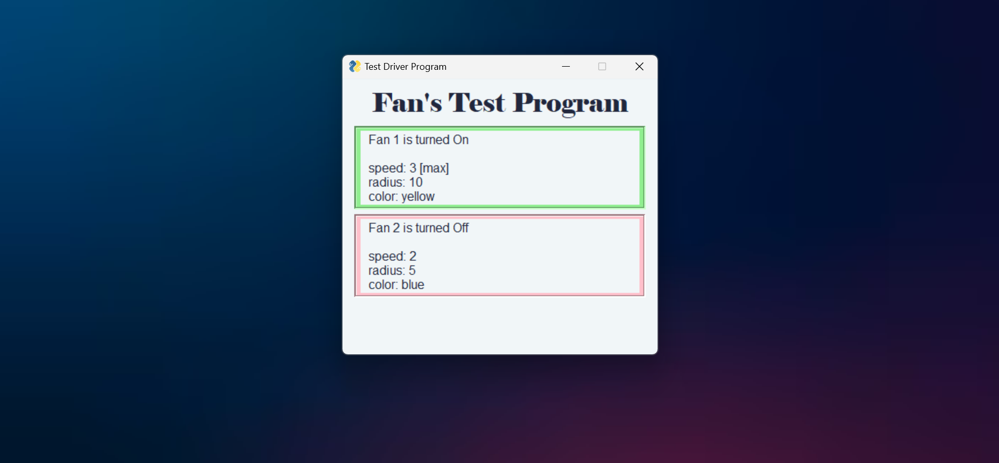
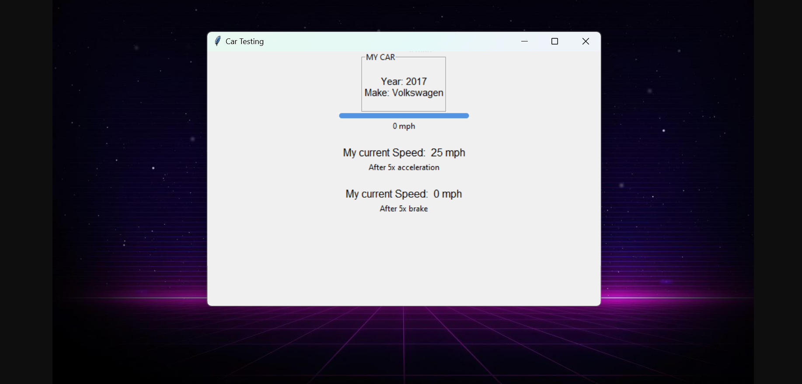
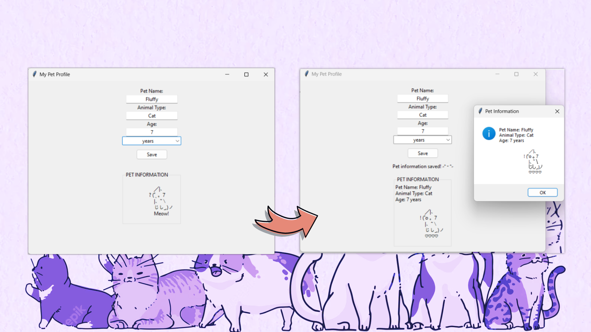

# Encapsulation and Abstraction in three Classes
## Repository Structure
This repository contains three main folders with the following python files:
1. **Fan class** folder - Contains the Fan class implementation.
    - ```Fan.py``` 
    - ```TestFan.py```
    - ```main.py```
2. **Car class** folder - Contains the Car class implementation.
    - ```Car.py``` 
    - ```Test.py```
    - ```main.py```
3. **Pet class** folder - Contains the Pet class implementation.
    - ```Pet.py``` 
    - ```TestPet.py```
    - ```main.py```
4. ***images*** *- contains images used for README.md*

# Getting Started
## Installation
To get started, you'll need to have [Python 3](https://www.python.org/downloads/) installed on your computer. 
Also, I used [VS Code](https://code.visualstudio.com/download) to create and run the program.

## Dependencies
To install the necessary modules, open up your terminal or command prompt and type:
1. For Fan class
    - ```pip install PysimpleGUI```
2. For Car class and Pet class
    - ```pip install tkinter```
    - ```pip install ttkthemes```
# Use
1. Clone or download the repository.
    - ```git clone <repository link>```
2. *Run python file* whichever button available in your IDE or run through *terminal*.
    - ```cd <Copy Path>```
        - cd means change directory. Find the folder in your IDE and copy path.
    - ```python <file name>.py```
        - this will run your chosen file. In this case, ```main.py``` of any folder.
3. Below will be the next event and instruction. Please follow.


## Fan class
4. The program will show the following output.
>
<br/>

## Car class
4. The program will show the following output.
5. During this, there will be a loading bar that indicates each speed change.
>
<br/>

## Pet class
4. The user will be asked to input their Pet's information.
    - Name:
    - Animal Type:
    - Age:
5. If the user click the ```save``` button without inputting. The program will asked them to input the required field.
    - User is allowed to characters and numbers. This is due to unique naming of pet owners.
    - Example: ```Xander5ive or Luna9th```
6. On the other hand, if user input characters in Age. The program will not accept and ask user to input correctly.
7. Additionally, in age field, there is age unit included so that user can specify their pet's age.
    - Choices are ```days, weeks, months, and years```
8. The program will show the following output.
>
<br/>

# Found a bug?
## Contribute
Pull requests are welcome. For major changes, please open an issue first to discuss what you would like to change.
## Contact Me
If you found a bug, you may contact me >>
[Facebook](https://www.facebook.com/irishcammagay1/)